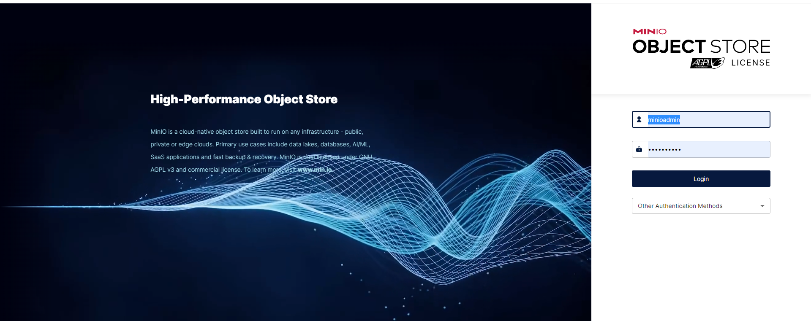
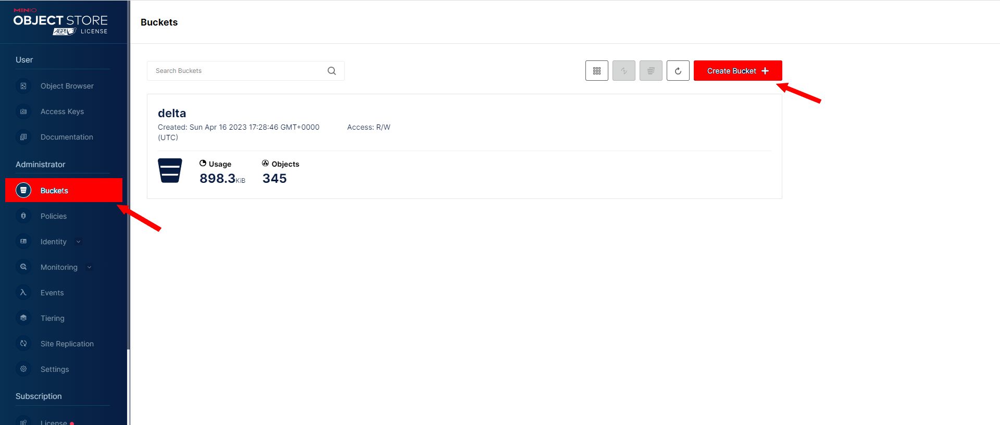
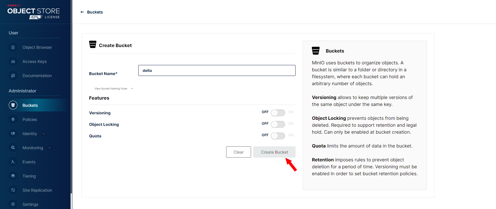
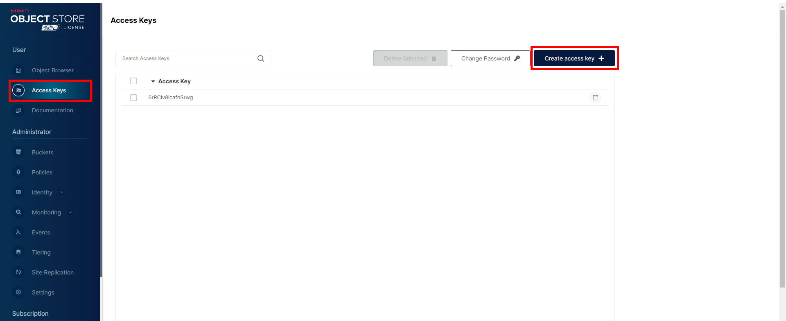
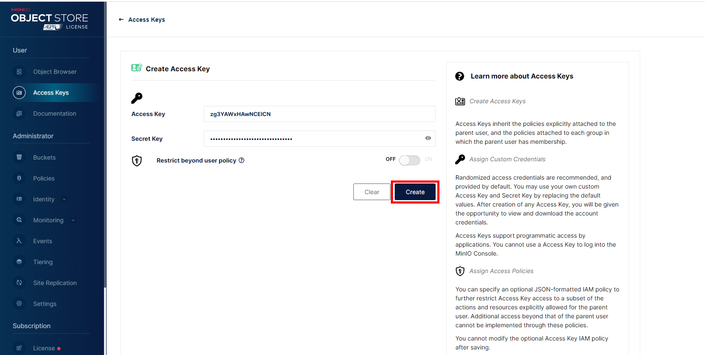
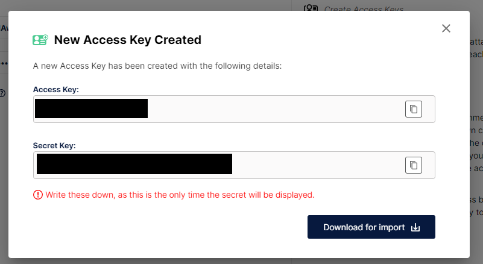

README.md
# Generate the application
## Decisions made :
```sh

1.OS used to test the app: Ubuntu 22.04.2 LTS


2.Java version: 17

3.Storage: Minio S3

4.Framework: We will use Spring Boot 2.7.10, because it’s the maximum version compatible version with spark.

5.Precompiler: We will not use any precompilers.

6.Project: architecture -We will follow a layered architecture, with a controller layer for handling requests, a service layer for business logic, and a data access layer for accessing Delta tables.
                        -We will also use Minio to simulate Amason S3 environment and to store Data.
                        -We will also manage a pool of SparkSession instances with configurating class 'SparkSessionPool.java'
```
##Instructions to run the code:
### Installing Minio:
```sh
1. Install Minio docker image and run the image:
   - docker pull minio/minio
   - docker run -p 9000:9000 -p 9001:9001 minio/minio server /data --console-address ":9001"
   
2. Go to 'http://localhost:9001/login' and sign in with default credentials (usename: minioadmin password: minioadmin)
```

```sh
3. Go to Bucket section and click 'create bucket'
```

```sh
4. Create new Bucket with Bucket Name : delta and click 'create bucket'
```

```sh
5. Go to Access Key and click 'Create access key'
```

```sh
6. A new window will appear and click create as bellow
```

```sh
7. Another window will appear with your access key and secret key. just copy them and save them somewhere we will use them later.
```


### Clonning the repository && Running Micro service:
```sh
1. Clone the Git repository: git clone ''

2. Navigate to the project directory: cd deltaLakeMinio

3. Navigate to application.properties and modify values of properties: (remember we already create Access Key and Secret Key in 'step 7' of 'Installing Minio')
   accessKey: 'Your Minio Access Key'
   secretKey: 'Your Minio secret key'
   
4. Build the Docker image: docker build -t deltalakeminio .
   Note: We have provided a Dockerfile for building the Docker image

5. Run the Docker container: docker run --rm -p 8080:8080 -it deltalakeminio:latest 
   
6. Access the Swagger UI by navigating to http://localhost:8080/swagger-ui/index.html

7. Execute this endpoint http://localhost:8080/swagger-ui/index.html#/shop-user-transaction-controller/insertData to insert Data Minio delta bucket
   NB: Every time you execute this endpoint you insert 100 random row in delta Minio bucket
8. You can now use others CRUD endpoints(GET, POST, PUT, DELETE)

9. If you want to test the application on IDE intellej or eclipse you must Run configuration and add this line without quotes 
   '--add-exports java.base/sun.nio.ch=ALL-UNNAMED --add-exports java.base/sun.util.calendar=ALL-UNNAMED' on VM options like on the picture :
```


### Dockerfile

```dockerfile

# Build stage
FROM maven:3.6-openjdk-17-slim AS build
WORKDIR /home/app
COPY pom.xml .
RUN mvn -B dependency:go-offline
COPY src/ /home/app/src/
RUN mvn -B clean package

# Package stage #
FROM openjdk:17-jdk
ENV JAVA_TOOL_OPTIONS="--add-exports java.base/sun.nio.ch=ALL-UNNAMED --add-exports java.base/sun.util.calendar=ALL-UNNAMED"
LABEL maintainer="Anas AIT RAHO <anas.aitraho@gmail.com>"
LABEL version="1.0"
LABEL description="Deltalake V1"
WORKDIR /app
COPY --from=build /home/app/target/deltalake-spark-minio.jar /app/deltalake-spark-minio.jar
EXPOSE 8080
RUN adduser --uid 1001 --disabled-password --gecos "" appuser
USER appuser
CMD ["java", "-jar", "/app/deltalake-spark-minio.jar"]


```
### application.yml
```sh
server:
  port: 8080

delta:
  tables:
    ShopUserTransactionPath: s3a://delta/analysis/shop_user_transaction/

spark:
  cluster:
    URL: local[*]
s3a:
  URL: http://localhost:9000
  accessKey: 'Your Minio Access Key'
  secretKey: 'Your Minio secret key'

maxSparkSessionInstances: 10

management:
  server:
    port: 9095
  security:
    enabled: false
  endpoints:
    web:
      exposure:
        include: "*"

```
Note:  This example uses a multi-stage build. The first stage is used to build the code. The second stage only contains the built jar and a JRE to run it (note how jar is copied between stages).

### Actuator
```sh
Actuator run on port 9095, to acces to actuator endpoints use http://localhost:9000/actuator
Example:  http://localhost:9095/actuator/health
```

